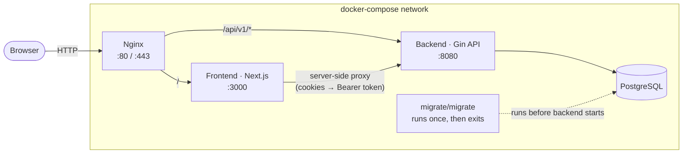

# Weekly Wrapped

> Your habits, wrapped weekly. Log daily activities and get a Spotify-Wrapped-style recap of your week, complete with a public, shareable page.

This is the **monorepo** that wires together the Weekly Wrapped platform: a Next.js frontend, a Go/Gin backend, PostgreSQL, and Nginx, orchestrated with Docker Compose.

- **Frontend repo:** [weekly-wrapped-fe](https://github.com/admalfrizi/weekly-wrapped-fe) (Next.js 16 / React 19)
- **Backend repo:** [weekly-wrapped-be](https://github.com/admalfrizi/weekly-wrapped-be) (Go / Gin)

Both are included here as **git submodules** so the whole stack can be cloned, configured, and run with a single Docker Compose command.

---

## Table of Contents

- [Features](#features)
- [Architecture](#architecture)
- [Tech Stack](#tech-stack)
- [Repository Structure](#repository-structure)
- [Getting Started](#getting-started)
  - [Prerequisites](#prerequisites)
  - [1. Clone with submodules](#1-clone-with-submodules)
  - [2. Configure environment variables](#2-configure-environment-variables)
  - [3. Run with Docker Compose](#3-run-with-docker-compose)
  - [4. Run services individually (local dev)](#4-run-services-individually-local-dev)
- [API Reference](#api-reference)
- [Database Schema](#database-schema)
- [Roadmap](#roadmap)
- [Author](#author)

---

## Features

- **Authentication** — register/login with bcrypt-hashed passwords, JWT access + refresh tokens
- **Activity logging** — create, update, and categorize daily activities with notes and timestamps
- **Weekly dashboard** — aggregated stats for the current week per user
- **Recap generation** — turns a week of activity into a saved recap (stats snapshot + narrative + unique slug)
- **Public share page** — server-rendered `/w/[slug]` page with Open Graph metadata, so recaps look good when shared
- **Private recap viewer** — authenticated `/recap/[slug]` view with a one-click "copy share link" action

## Architecture

Nginx sits in front of everything and routes traffic by path: `/` goes to the Next.js frontend, `/api/v1/*` goes straight to the Go backend. A one-off `migrator` container runs database migrations before the backend is allowed to start.



The frontend also uses a **BFF-style proxy** (`/api/proxy/[...path]`) for client-triggered requests, so the browser only ever talks to the Next.js origin, never directly to the Go API. This keeps the JWT out of client-side JavaScript — it's read from an HTTP-only cookie on the server and attached as a `Bearer` token when forwarding the request.

## Tech Stack

| Layer | Stack |
|---|---|
| **Frontend** | Next.js 16 (App Router), React 19, TypeScript, TanStack Query, TanStack Table, React Hook Form + Zod, shadcn/ui, Tailwind CSS v4, Recharts, Axios |
| **Backend** | Go, Gin, pgx (PostgreSQL driver), JWT (golang-jwt), bcrypt, layered handler → service → repository architecture |
| **Database** | PostgreSQL, schema-versioned with `golang-migrate` |
| **Infrastructure** | Docker, Docker Compose, Nginx (reverse proxy) |

## Repository Structure

```
weekly-wrapped/
├── weekly-wrapped-fe/       # submodule → weekly-wrapped-fe
├── weekly-wrapped-be/       # submodule → weekly-wrapped-be
├── docker-compose.yml       # orchestrates db, migrator, backend, frontend, nginx
├── nginx.conf                # reverse proxy: "/" → frontend, "/api/v1/" → backend
└── .gitmodules
```

<details>
<summary><strong>weekly-wrapped-fe layout</strong></summary>

```
weekly-wrapped-fe/
├── src/
│   ├── app/
│   │   ├── (auth)/login, register        # public auth pages
│   │   ├── (root)/                       # dashboard, activities, private recap view
│   │   ├── w/[slug]/                     # public, SSR share page for a recap
│   │   ├── api/proxy/[...path]/          # BFF proxy → backend, attaches JWT server-side
│   │   └── api/auth/                     # login/register route handlers
│   ├── features/                         # feature-based modules: auth, activities, dashboard, recap
│   ├── components/                       # shared UI (shadcn/ui based)
│   └── config.ts                         # API URL config
└── Dockerfile
```

</details>

<details>
<summary><strong>weekly-wrapped-be layout</strong></summary>

```
weekly-wrapped-be/
├── cmd/main.go                # entrypoint, dependency wiring
├── internal/
│   ├── controller/             # HTTP handlers
│   ├── service/                 # business logic
│   ├── repository/               # data access (pgx)
│   ├── router/                    # route groups per resource
│   ├── middleware/                # JWT auth middleware
│   ├── model/ · dto/ · response/  # domain models, request/response shapes
│   └── config/                    # env config + DB connection
├── db/
│   ├── migrations/            # golang-migrate SQL files
│   └── seeders/                # category seed data
└── Dockerfile
```

</details>

## Getting Started

### Prerequisites

- [Docker](https://www.docker.com/) and Docker Compose (recommended — runs the full stack)
- For local, non-Docker development: **Node.js 22+** and **Go 1.26+**, plus a local PostgreSQL instance

### 1. Clone with submodules

```bash
git clone --recurse-submodules https://github.com/admalfrizi/weekly-wrapped.git
cd weekly-wrapped
```

If you already cloned without `--recurse-submodules`:

```bash
git submodule update --init --recursive
```

### 2. Configure environment variables

The backend needs its own `.env` file (referenced by `docker-compose.yml` via `env_file`):

```bash
# weekly-wrapped-be/.env
JWT_SECRET=replace-with-a-long-random-secret
```

`DB_*` values default sensibly for local Docker use (see `docker-compose.yml`), but can be overridden at the repo root via a `.env` file read by Compose:

```bash
# weekly-wrapped/.env (optional — defaults shown)
DB_USER=root
DB_PASSWORD=lokal26
DB_NAME=weekly-wrapped-db
DB_PORT=5432
```

> ⚠️ Set a strong, unique `JWT_SECRET` — the backend will refuse to start without one.

### 3. Run with Docker Compose

```bash
docker compose up --build
```

This brings up, in order: **PostgreSQL** → **migrator** (runs SQL migrations, then exits) → **backend** (Gin API on `:8080`) → **frontend** (Next.js on `:3000`) → **Nginx** (public entrypoint).

Once healthy, the app is available at **http://localhost**.

### 4. Run services individually (local dev)

**Backend**

```bash
cd weekly-wrapped-be
go run ./cmd
# or, with hot reload:
go install github.com/air-verse/air@latest
air -c .air.toml
```

**Frontend**

```bash
cd weekly-wrapped-fe
npm install
npm run dev
```

## API Reference

All endpoints are prefixed with `/api/v1`. Routes marked 🔒 require a `Bearer` JWT (set via the `Authorization` header).

| Resource | Method | Endpoint | Description |
|---|---|---|---|
| Health | `GET` | `/ping` | Liveness check |
| Auth | `POST` | `/auth/register` | Create a new account |
| Auth | `POST` | `/auth/login` | Log in, returns access + refresh tokens |
| Auth | `POST` | `/auth/refresh` | Exchange a refresh token for a new access token |
| Users 🔒 | `GET` | `/users/me` | Get current user profile |
| Users 🔒 | `POST` | `/users/me` | Update current user profile |
| Activities 🔒 | `GET` | `/activity` | List activities |
| Activities 🔒 | `GET` | `/activity/categories` | List activity categories |
| Activities 🔒 | `POST` | `/activity` | Create an activity |
| Activities 🔒 | `GET` | `/activity/:id` | Get a single activity |
| Activities 🔒 | `PUT` | `/activity/:id` | Update an activity |
| Activities 🔒 | `DELETE` | `/activity/:id` | Delete an activity |
| Dashboard 🔒 | `GET` | `/dashboard/weekly` | Aggregated stats for the current week |
| Recaps 🔒 | `POST` | `/recaps/generate` | Generate (or regenerate) the weekly recap |
| Recaps | `GET` | `/recaps/:slug` | Fetch a recap by its public slug (used by the `/w/[slug]` share page) |

## Database Schema

Four tables, managed via `golang-migrate` (`weekly-wrapped-be/db/migrations`):

- **`users`** — account info, bcrypt password hash
- **`categories`** — activity categories (seeded on backend startup)
- **`activities`** — user activity entries, linked to a category, indexed by `(user_id, occurred_at)`
- **`weekly_recaps`** — one recap per `(user_id, week_start)`, storing a JSONB stats snapshot, a generated narrative, and a unique public `slug`

## Roadmap

- [ ] Replace the current templated Bahasa Indonesia narrative with a more dynamic (e.g. LLM-generated) recap
- [ ] Add automated tests for backend services/repositories
- [ ] CI pipeline for lint/build/test on both submodules
- [ ] HTTPS/TLS termination in `nginx.conf` (currently HTTP only, with a commented-out TLS block ready to fill in)

### Waktu yang saya habiskan untuk Projek ini sekitar 5 Hari.

## Author

**Adam Alfarizi Ismail** — [@admalfrizi](https://github.com/admalfrizi)
